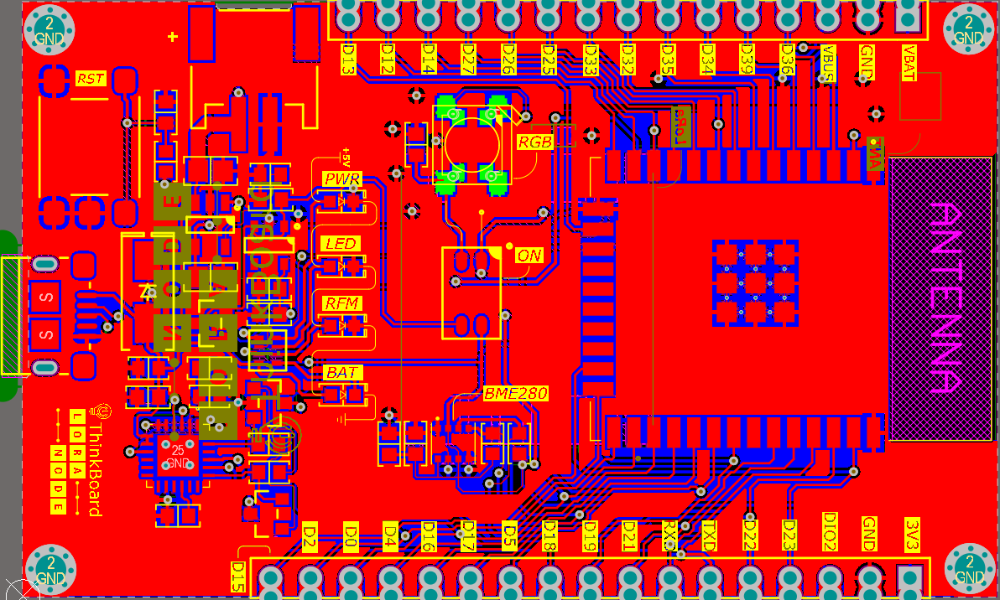

# ThinkBoard LoRa Node V1
Official board for thinkthings.id

## Deskripsi 
ThinkBoard LoRa Node V1 merupakan development board berbasis mikrokontroler ESP32 yang dilengkapi dengan modul radio HopeRF LoRa RFM95W 915MHz, sensor BME280 dan RGB LED WS2812 yang terintegrasi. Development board ini dirancang untuk mendukung segala kebutuhan pengguna dalam proyek Internet of Things, dengan tersedianya berbagai konektivitas seperti Bluetooth Low Energy, Wi-Fi, dan LoRa membuat development board ini sangat fleksibel untuk digunakan pada berbagai jaringan.

## Spesifikasi
**•	MCU :** ESP32 WROOM Dual – Core 4MB SPI Flash

**•	Dimensions :** 62mm x 38mm

**•	Headers :** 1x15 Pin & 1x17 Pin with 2.54mm pitch and castellated holes

**•	GPIO :** 26 pin GPIO @3V3 Logic Level: 2 x UART, 2 x SPI, 1 x I2C, 16 x 12 bits ADC, 2 x 8 bits DAC, 10 x Touch Capacitive, 16 x PWM Output Channels

**•	USB to UART :** Silicon Labs CP2104 USB – to – UART Bridge Controller

**•	Connectivity :** LoRa RFM95W 915MHz, Wi-Fi, Bluetooth

**•	Built-in Sensor :** BME280 digital humidity, pressure, and temperature sensor @0x76 address

**•	Built-in LED :** 3 x single color indicator LED, 1 x single color built-in LED attached to GPIO2, 1 x RGB LED WS2812 attached to GPIO33

**•	Power :** AP2112K 3.3V LDO 600mA regulator, USB or battery operated Vin : 6.5V max / 5V typ. / 4.2V min

**•	Battery Charger :** MCP7831 Single Cell Li-Ion, Li-Po battery charger

**•	Connector :** USB Micro B, U.FL antenna connector

## Pinout Diagram

***Catatan :** GPIO 34-39 hanya dapat digunakan sebagai input

## BOM's
No | Designator                        | Item/Value    | Footprint     | Quantity
-- | --------------------------------- | ------------- | ------------- | -------------
1  |  C1, C2, C4, C7, C8, C11, C12, C13| 1µF           | Ceramic 0603  | 8             |
2  |  C6                               | 4.7µF         | Ceramic 0603  | 1             |
3  |  C3, C5                           | 10µF          | Ceramic 0603  | 2             |
4  |  C9, C10                          | 4.7µF         | Ceramic 0805  | 2             |
5  |  C6                               | 4.7µF         | Ceramic 0603  | 1             |
6  |  R4, R5, R7, R8, R9, R10          | 10KΩ          |   1/16W 0603  | 6             |
7  |  R2                               | 100KΩ         |   1/16W 0603  | 1             |
8  |  R3                               | 4K7Ω          |   1/16W 0603  | 1             |
9  |  R6                               | 1KΩ           |2X4 ARRAY 0804 | 1             |
10 |  D1                               | 1N5822        |     DO214     | 1             |
11 |  D2                               | LED YELLOW    |     0603      | 1             |
12 |  D3                               | LED BLUE      |     0603      | 1             |
13 |  D4                               | LED GREEN     |     0603      | 1             |
14 |  D5                               | LED RED       |     0603      | 1             |
15 |  D2                               | LED YELLOW    |     0603      | 1             |
16 |  LED                              | WS2812B       |     5050      | 1             |
17 |  D2                               | LED YELLOW    |     0603      | 1             |
18 |  IC1                              | SI2301        |    SOT-23     | 1             |
19 |  IC2                              | AP2112K       |    SOT-25     | 1             |
20 |  IC3                              | MCP73831      |   SOT-23-5    | 1             |
21 |  U1                               | ESP32 WROOM   |   WROOM-32    | 1             |
22 |  U2                               | CP2104        |    QFN-24     | 1             |
23 |  U3                               | BME280        |  8 Pin - LGA  | 1             |
24 |  U4                               | RFM95W        |   8 x 2 Pin   | 1             |
25 |  Q1, Q2                           | MMBT3904      |    SOT-23     | 2             |
26 |  S1                               | Tactile Switch|     5 Pin     | 1             |
27 |  SW1                              | DIP Switch    |     2 Pin     | 1             |
28 |  SW1                              | DIP Switch    |     2 Pin     | 1             |
29 |  J1                               | PH Connector  |   2 Pin SMD   | 1             |
30 |  J2                               | USB Micro B   |      SMD      | 1             |
31 |  P1                               | Header 1x15   |  2.54mm Pitch | 1             |
32 |  P2                               | Header 1x17   |  2.54mm Pitch | 1             |
33 |                                   | U.FL Connector|      SMT      | 1             |

## Desain

### Top Layer
 

### Bottom Layer
